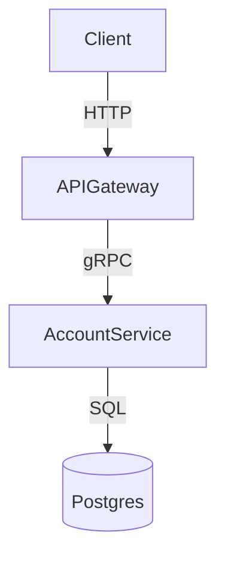

# SKILL: System Diagram and Data-Flow Documentation

## Purpose
Represent system architecture and data flows in a clear, structured, and unambiguous visual or textual diagram format that can be consumed by downstream agents and developers without requiring the reader to consult additional documents.

## When to Use
- Illustrating the major components of a system and their relationships in `architecture-plan.md`.
- Showing how data moves through the system for a key operation (e.g. a payment transaction, an authentication flow).
- Documenting service boundaries, external integrations, and communication patterns.
- Clarifying a complex interaction that prose alone cannot represent clearly.

## Diagram Types and When to Use Each

| Type | Use When |
|---|---|
| **System Context Diagram** | Showing the application and all external actors/systems it interacts with |
| **Component Diagram** | Showing the major internal components and their dependencies |
| **Sequence Diagram** | Showing the order of interactions for a specific operation or flow |
| **Data Flow Diagram** | Showing how data is transformed and moved between components |
| **Entity Relationship Diagram** | Showing the data model and relationships between entities |

## How to Apply

### 1. Use Mermaid syntax for all diagrams in markdown documents
All diagrams in pipeline documents must use [Mermaid](https://mermaid.js.org/) syntax embedded in a fenced code block. This ensures diagrams are version-controllable, diffable, and renderable by any agent or markdown viewer.

### 2. Name every node with a meaningful identifier
Node labels must describe the component's role, not its implementation technology. Use `AccountService` not `Go Binary 1`.

### 3. Label every edge with the communication protocol or data type
Every arrow between components must carry a label: the protocol (HTTP, gRPC, AMQP), the message or event type, or the data being passed. Unlabelled edges are not permitted.

### 4. Scope each diagram to one concern
A single diagram should illustrate one architectural concern. Do not attempt to show all components, all flows, and all data models in one diagram. Split them.

### 5. Write a prose caption beneath every diagram
Every diagram must be followed by a short paragraph explaining what it shows, what the key relationships are, and any important constraints or invariants that are not visible in the diagram itself.

### 6. Version diagrams alongside the documents that contain them
When an architectural decision changes a diagram, update the diagram in the same commit/change as the relevant ADR.

## Rules
1. All diagrams in pipeline markdown documents must use Mermaid syntax — image files, external links, or ASCII art are not acceptable substitutes.
2. Every edge must be labelled — an arrow with no label communicates nothing about the nature of the relationship.
3. Every diagram must have a prose caption; a diagram without explanation is ambiguous.
4. Diagrams must be consistent with the text of the document they appear in — a diagram that contradicts the surrounding prose is a defect.
5. Do not include implementation details (class names, function signatures, variable names) in architectural diagrams — those belong in code, not in architecture documents.
